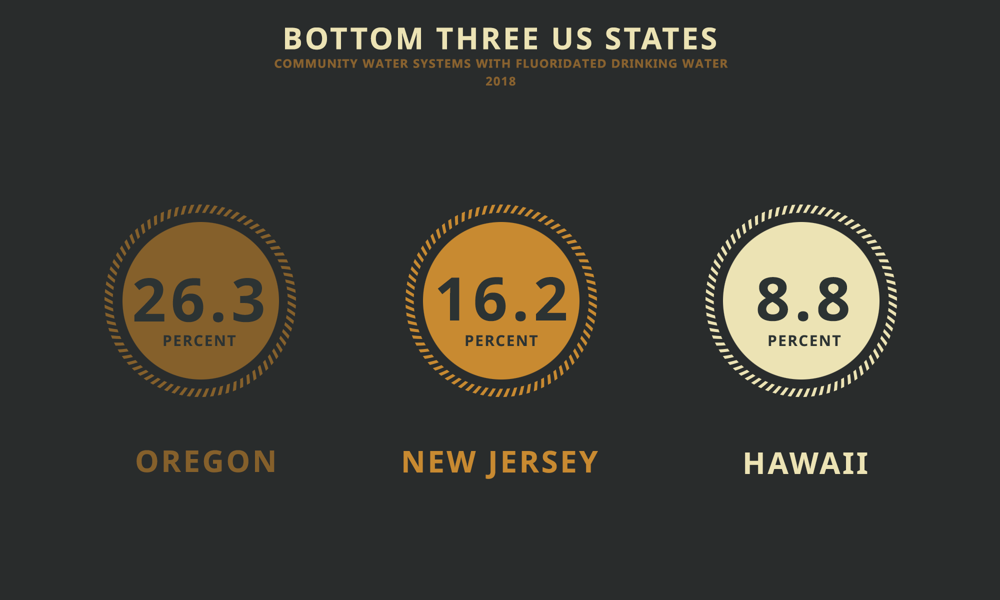

<strong>ABOUT</strong> 
 
While the World Health Organization (WHO) supports the use of fluoride in drinking water, there is a significant disparity between the United States and Western Europe regarding water fluoridation practices. 

In Western Europe, the vast majority of countries do not fluoridate their public water systems. According to available data, approximately 97% of Western Europe does not engage in water fluoridation practices. This figure reflects a regional trend where alternative methods, such as topical fluoride applications and the use of fluoride toothpaste, are primarily relied upon to maintain dental health.

In contrast, the United States has a significantly higher prevalence of water fluoridation in public water systems. Over 70% of the public water systems in the US currently provide fluoridated water to their communities. However, it is important to note that water fluoridation rates in the US vary from state to state.

For instance, Hawaii had only 8.8% of its public water systems fluoridating water in 2018. On the other hand, Washington DC demonstrated the highest water fluoridation rate, with 100% of its public water systems serving fluoridated water. 

To provide a broader perspective, let's consider the average water fluoridation rates for the bottom three states (Hawaii, New Jersey, Oregon) and the top three (Washington DC, Kentucky, Minnesota). The bottom three states had an average of 17.1% of their public water systems fluoridating water, indicating a relatively lower adoption of water fluoridation. Conversely, the top three states had an average of 99.53% of their public water systems serving fluoridated water, highlighting a significantly higher prevalence of water fluoridation.

You can find this data sheet at https://catalog.data.gov/dataset/u-s-chronic-disease-indicators-cdi

<strong>WHAT HAVE I COVERED?</strong> 
 
1. USA map showing percentage of fluoridated water in public water systems
2. Line chart covering percentage of public water systems serving fluoridated water from 2012-2018
3. Top three states with fluoridated water in public water systems
4. Bottom three states with fluoridated water in public water systems

<strong>SCREENSHOTS</strong>

